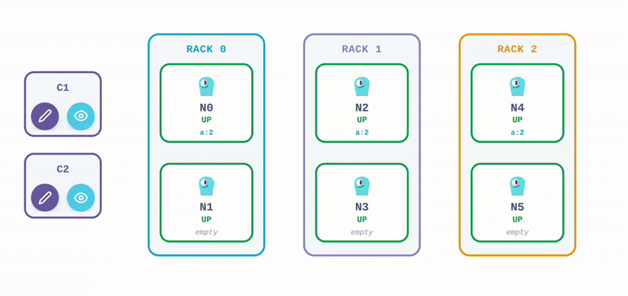

# ScyllaDB HA Simulator

An interactive, single-file simulator of ScyllaDB's replication, consistency levels, and fault tolerance — built to make Replication Factor (RF) and Consistency Level (CL) tradeoffs visible rather than abstract.

Nodes are grouped into zones/racks; each client sends writes and reads that animate through a coordinator and the key's natural replicas, so you can watch RF/CL decide in real time whether a request succeeds. Click a node to take it down, or a zone/rack's border to take the whole zone/rack down together, and see how the cluster responds.

**Disclaimer:** An independent, educational simulator — not an official ScyllaDB product and not 100% behaviorally accurate to real ScyllaDB internals. Not affiliated with or endorsed by ScyllaDB, Inc.



## Features

- Adjustable nodes, zones/racks, replication factor, consistency level, and client count
- Per-client Write / Read buttons — requests visibly originate from a specific client
- Zone/rack-aware replica placement, with click-to-kill/revive on both individual nodes and whole zones/racks
- A "Smart Drivers" toggle to compare token-aware routing against a non-token-aware proxy hop
- A first-visit guided tour of the core interactions
- Styled with the ScyllaDB design system

## Running it

This is a static, dependency-free single HTML file. Clone the repo and open `index.html` in a browser — no build step, no server required.

```bash
git clone https://github.com/<you>/scylladb-ha-demo.git
cd scylladb-ha-demo
open index.html   # or just double-click it / drag into a browser
```
